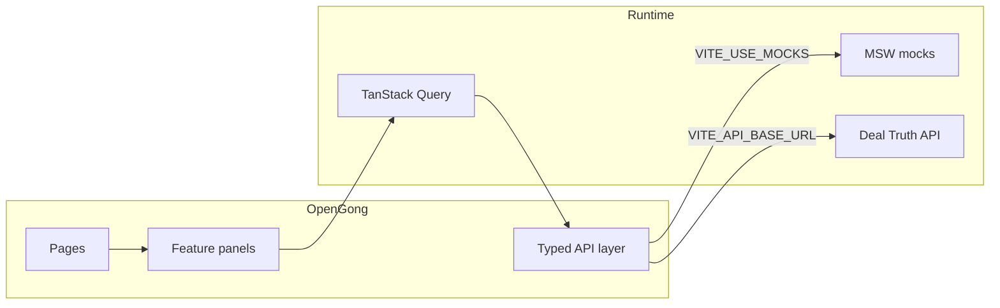

<div align="center">

# OpenGong

**Turn conversations into deal intelligence.**

Upload a sales call. Get a transcript, a score, and every claim tied back to the exact moment it was said.

[](https://www.typescriptlang.org/)
[](https://react.dev/)
[](https://vite.dev/)
[](LICENSE)

<br />

[Quick start](#quick-start) · [Features](#what-it-does) · [Architecture](#architecture) · [Configuration](#configuration)

</div>

---

OpenGong is the standalone web client for **Deal Truth** — an evidence-first conversation intelligence product. It is not a dashboard of AI summaries. Every signal, objection, and follow-up sentence can jump to the transcript and play the audio.

> **Deal Truth** is the API. **OpenGong** is the workspace you actually use.

```
Upload  →  Transcribe  →  Analyze  →  Evidence-linked report
```

## Why it exists

Most call tools tell you *what happened*. OpenGong tells you **what you can prove**.

| Typical call intelligence | OpenGong |
| --- | --- |
| A generated paragraph | A scored narrative with clickable evidence |
| “The customer likes the product” | The exact quote, speaker, and timestamp |
| A follow-up draft you hope is accurate | Sentences that stay until you remove unsupported claims |
| A dump of insights | Reality checks: seller implied vs. customer said |

## What it does

**Workspace** — Drop an audio file on the home page, or open recent conversations with deal-risk badges and next-step recommendations.

**Call intelligence** — Five views on every shipped call:

| View | What you get |
| --- | --- |
| **Overview** | Score, narrative, buying signals, and attention items |
| **Outline** | Timed chapters you can jump into |
| **Transcript** | Speakers, annotations, and play-from-here |
| **Insights** | The full intelligence stack (below) |
| **Call info** | Metadata, participants, and export |

**Insights stack**

- **Customer truth** — facts the buyer actually stated
- **Objections** — concerns, with evidence
- **Reality check** — seller implication vs. customer reality
- **Commitment ledger** — who promised what, and when
- **Deal killers** — risks that can stall or lose the deal
- **Competitors & moments** — named rivals and high-signal beats
- **Next-call battlecard** — goal, questions, and what not to forget
- **Manager brief** — copy-ready deal snapshot
- **Evidence-safe follow-up** — generate, strip unsupported lines, copy
- **Ask this call** — retrieval-first Q&A over the recording
- **Buyer sentiment** — how the room moved over time

**Search** — Ask across every conversation (`pricing objections`, `no next step`, competitor mentions) and land on the playable moment.

**Share** — Mint a read-only link to a report. Invalid, expired, or revoked tokens fail closed.

**Ingest** — Upload `mp3` / `wav` / `m4a` / `webm` / `ogg` (up to 80 MB) or register an HTTPS recording URL. Watch processing stages live.

## Quick start

Requires **Node.js 22+**.

```bash
git clone https://github.com/mabhinav004/deal-truth-ui.git
cd deal-truth-ui
npm install
cp .env.example .env
npm run dev
```

Open [http://localhost:5173](http://localhost:5173).

With an empty `VITE_API_BASE_URL`, the app starts **Mock Service Worker** automatically. You get a full workspace — including the Acme SaaS Labs sample call — without a backend.

To talk to a live Deal Truth API:

```bash
# .env
VITE_API_BASE_URL=http://localhost:8000
VITE_USE_MOCKS=false
```

Restart the Vite server after changing env vars.

## Configuration

Copy [`.env.example`](.env.example). Values are read at build time (`VITE_*`).

| Variable | Purpose |
| --- | --- |
| `VITE_API_BASE_URL` | Deal Truth API origin. Empty → mocks unless you force them off. |
| `VITE_USE_MOCKS` | `true` / `false`. Defaults to **on** when no API URL is set. |
| `VITE_DEMO_CALL_ID` | Call opened by `/demo` (default `call-acme-saas-labs`). |
| `VITE_API_KEY` | Optional. Sent as `X-API-Key`. Never commit a real key. |
| `VITE_NGROK_SKIP_BROWSER_WARNING` | Set when the API is reached through ngrok. |

Secrets belong in `.env` (gitignored) or your host’s secret store — not in source, Dockerfiles, or this README.

## Scripts

| Command | What it runs |
| --- | --- |
| `npm run dev` | Vite on port **5173** |
| `npm run build` | Typecheck + production bundle |
| `npm run preview` | Serve the production build |
| `npm run lint` | ESLint |
| `npm run typecheck` | `tsc --noEmit` |
| `npm test` | Vitest (unit + component) |
| `npm run test:e2e` | Playwright |
| `npm run screenshot:demo` | Capture `/demo` into `artifacts/` |
| `npm run format` | Prettier |

## Architecture



The UI never talks to raw JSON from screens. Contracts live in `src/api/contracts` (Zod schemas + types). Adapters map wire format to those contracts. Feature panels consume typed reports only.

```
src/
├── app/                 Routes
├── pages/               Workspace, upload, processing, call, search, share
├── features/            Intelligence panels (one concern each)
├── components/          Layout, audio, transcript, evidence, UI primitives
├── api/
│   ├── contracts/       Schemas, types, enums
│   ├── endpoints/       Calls, transcripts, search, share, …
│   ├── adapters.ts      Wire → domain
│   └── client.ts        Fetch, timeouts, X-Request-ID, X-API-Key
├── hooks/               React Query wrappers
├── mocks/               MSW handlers + fixtures
└── config/              Environment
```

**Processing** polls `/events` as the source of truth. An SSE `processing` stream, when available, wakes the poller so the timeline stays live without depending on EventSource alone.

**Evidence** is a first-class UX: click an insight → drawer with “why we think this” → jump to transcript and play from that segment.

## Routes

| Path | Screen |
| --- | --- |
| `/` | Workspace — drop a file, recent calls, recommendations |
| `/upload` | Full ingest form (file or HTTPS URL) |
| `/calls/:id/processing` | Live processing timeline |
| `/calls/:id/*` | Call workspace (`overview`, `outline`, `transcript`, `insights`, `info`) |
| `/search` | Cross-call search |
| `/shared/:token` | Read-only shared report |
| `/demo` | Deep-link into the demo call |

## Docker

The image is a Vite build served by nginx. `/api/` is proxied to an `api` upstream (Deal Truth on port 8000).

```bash
docker build \
  --build-arg VITE_API_BASE_URL= \
  --build-arg VITE_USE_MOCKS=false \
  -t opengong-web .
```

`VITE_*` values are baked in at **build** time. Do not pass API keys as build args; inject them at runtime only if the host supports it, or keep the UI behind the same origin as the API.

## Tech stack

React 18 · TypeScript · Vite 7 · Tailwind CSS · TanStack Query · React Router 7 · Zod · Recharts · MSW · Vitest · Playwright · Lucide

The visual language is paper (`#f3efe8`), ink, and violet — Plus Jakarta Sans for UI, IBM Plex Mono for timestamps and IDs.

## Contributing

1. Keep intelligence panels small and evidence-linked.
2. Put new API shapes in Zod contracts first, then adapters, then UI.
3. Prefer named constants over magic strings (statuses, audio limits, view ids).
4. Run `npm run typecheck && npm test && npm run lint` before opening a PR.

## License

[MIT](LICENSE) © 2026 OpenGong contributors
